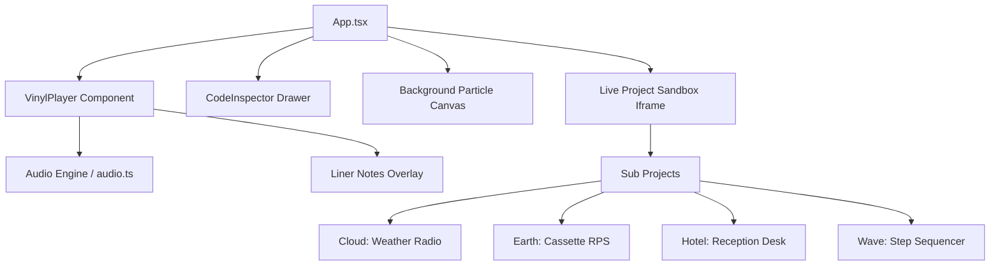

# Groove 📻🌿☕

[](https://opensource.org/licenses/MIT)
[](https://vitejs.dev/)
[](https://reactjs.org/)
[](https://developer.mozilla.org/en-US/docs/Web/API/Web_Audio_API)
[](https://www.typescriptlang.org/)

**Groove** is a tactile, relaxing, high-fidelity vinyl record player showcase designed to run interactive web projects as physical, illustrated record albums. Instead of clicking standard directory structures or card links, users swipe through record sleeves in a wooden crate shelf and place records on a spinning turntable platter, dropping the mechanical tonearm to spin the vinyl and run sandboxed code modules.

---

## 📻 Aesthetic & Interactive Highlights

- 📦 **Tactile Vinyl Crate Shelf**: Cycle through album sleeves with rich, illustrated front artworks in a custom responsive grid.
- 💿 **Top-Down Vintage Turntable**: A mechanical, top-down vinyl record player with a rotating record label, realistic grooved texture, and an animated tonearm that slides into place.
- 🔊 **Audio System Controls**: Includes a physical, toggleable system audio button and red indicator LED to activate interactive sound waves and procedural click/hover effects.
- 📓 **Registry Liner Notes Booklet**: A special "Guest Registry" record in the archive opens a registry book when played, letting visitors read and inscribe physical messages.
- 💻 **Fullscreen Live Sandbox**: Zoom cleanly into the active sandboxed sub-project with an integrated split-screen code view for live tweaking.
- 🌌 **Dynamic Ambiance Engine**: Features background particle systems (falling rain, sparkles, digital lasers) and low-frequency synthesized soundscapes that shift colors and frequencies based on the active album.

---

## 🚀 Re-Engineered Analog Projects

Groove hosts four unique, beautifully crafted interactive physical device simulators:

### 1. ☀️ Cloud (Vintage Weather Radio)
- **Concept**: A bakelite AM weather radio dial console with a temperature-controlled analog needle gauge.
- **Audio**: Synthesizes atmospheric sound frequencies (low static hiss for rain, warm sine pads for sun, and auto-rickshaw horns for Delhi).
- **Stack**: `HTML` • `CSS` • `Web Audio API` • `Weather API`

### 2. ✊ Earth (Retro Cassette Deck)
- **Concept**: A classic Rock-Paper-Scissors game re-imagined as a physical 1980s tape console.
- **Interactions**: Spinning cassette reels, VU volume level indicators, tape counter round displays, and physical buttons (`[ROCK]`, `[PAPER]`, `[SCISSORS]`).
- **Feature**: An active **TAPE TILT** toggle switch that bends output frequency pitches down 35% and activates cheat mode!
- **Stack**: `HTML` • `CSS` • `Web Audio API` • `Local Storage`

### 3. 🏨 Hotel (Grand Horizon Registry Console)
- **Concept**: A luxury reception desk cabinet styled with gold accents and a dark obsidian theme.
- **Interactions**: Brass suite keys hanging on physical pegs. Detaching a key triggers room locator compass rotations, custom lobby chime synthesis, and auto-fills a paper check-in ledger.
- **Special Feature**: Generates custom **Digital Keycard Entry Passes** upon check-in with random IDs, check-in timestamps, typewriter sound effects on key entry, and custom printable visual barcodes.
- **Storage**: Built with a sandboxed sandbox-safe fallback wrapper to support memory fallback if `localStorage` is blocked in frames.
- **Stack**: `HTML` • `CSS` • `Web Audio API` • `SafeStorage Wrapper`

### 4. 🎛️ Wave (Step Sequencer & Drum Machine)
- **Concept**: A retro-style 8-step hardware step sequencer and drum controller.
- **Interactions**: Wooden side-panelling, 4 separate instrument tracks (Kick, Snare, Hi-hat, Synth melody), 8 step LED pads per track with custom glowing channels, active running playhead indicator dot, and BPM tempo slider.
- **Audio**: Features full browser AudioContext audio synthesis generating low-end kick thuds, filtered highpass snare noise, hi-hat ticks, and pentatonic scale beep patterns.
- **Stack**: `HTML` • `CSS` • `Web Audio API` • `JavaScript`

---

## 🛠️ Developer Setup & Run Guide

### 1. Clone & Enter Directory
```bash
git clone https://github.com/nandinigoyaldev/100-projects.git
cd 100-projects
```

### 2. Install Dependencies
```bash
npm install
```

### 3. Run Development Server
- **Frontend & Sandboxes**:
  ```bash
  npm run dev
  ```
- **Backend Guestbook Server** (Optional, falls back to localStorage/memory):
  ```bash
  npm run server
  ```

### 4. Build Production Bundle
```bash
npm run build
```

---

## 📐 Project Architecture



---

*Curated with ☕ by Nandini Goyal // Open Source contribution Atelier.*
